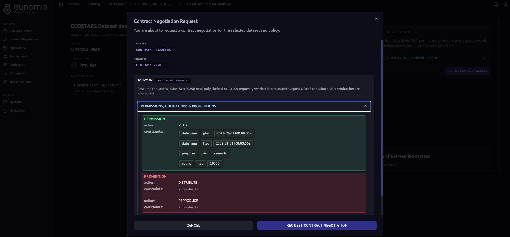
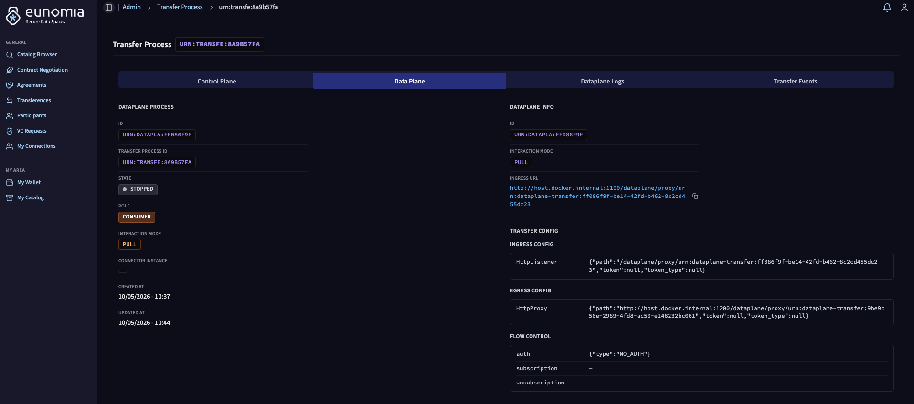
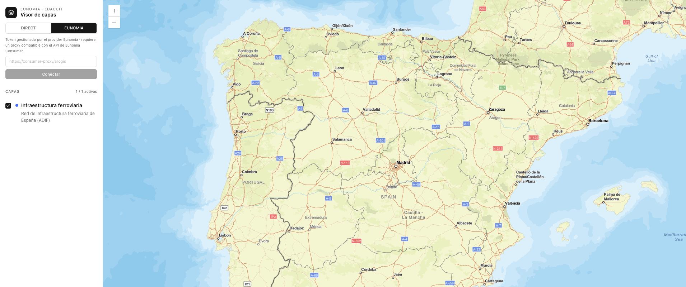

# EDACCIT Deployment

[](https://opensource.org/licenses/Apache-2.0)
[](https://www.docker.com/)
[](https://developers.arcgis.com/)
[](https://fastapi.tiangolo.com/)
[](https://react.dev/)
[](https://gaia-x.eu/)
[](https://docs.internationaldataspaces.org/ids-knowledgebase/v/dataspace-protocol)

This repository contains the artifacts and scripts to deploy and demonstrate the **EDACCIT** pilot on top of the **Eunomia** dataspace framework. The pilot models a geospatial data exchange: a **Provider** publishes transport and meteorological datasets hosted on an ArcGIS Enterprise server, and a **Consumer** negotiates governed access to them — both as participants of an Eunomia dataspace. A **Map Viewer** renders the datasets and can switch at runtime between direct access and dataspace-mediated proxy access.

---

## Architecture

```text
                          ┌─────────────┐
                          │  Heimdall   │  (Authority / Clearing House)
                          └──────┬──────┘
                                 │
            ┌────────────────────┴────────────────────┐
            │                                         │
    ┌───────▼────────┐                       ┌────────▼────────┐
    │ Provider Agent │  ◄── DSP transfer ──► │ Consumer Agent  │
    └───────┬────────┘                       └────────┬────────┘
            │                                         │
    ┌───────▼────────┐                       ┌────────▼────────┐
    │ ESRILab ArcGIS │                       │   Map Viewer    │
    │    Server      │                       │ React + FastAPI │
    └────────────────┘                       └────────────────┘
```

### Dataspace layer (Eunomia)

- [**Eunomia DS-Agent**](https://github.com/EunomiaUPM/ds-agent): Dataspace Agents handling DSP protocol logic for each participant.
- [**Heimdall**](https://github.com/EunomiaUPM/heimdall): Dataspace Authority and Clearing House governing onboarding and compliance.

### EDACCIT layer

- **Provider**: The ESRILab ArcGIS Enterprise server (`edaccit.esrilab.es`). Its datasets are described as DCAT-AP 3.0.1 metadata and published to the Provider Agent's catalog by the metadata ingestion pipeline.
- **Map Viewer**: A React application using the ArcGIS Maps SDK. It supports two access modes selectable at runtime from the sidebar:
  - **DIRECT** — the FastAPI backend fetches a token from ESRILab and proxies it to the SDK. Used for development.
  - **EUNOMIA-CONSUMER** — the user pastes the dataplane proxy URL obtained after a DSP negotiation. The SDK routes all requests through the Consumer's transfer endpoint; the token is injected server-side by the Provider Agent. No credentials are exposed to the browser.

---

## Catalog

The Provider publishes the following datasets:

| Dataset                                                | Source         | Type          |
| ------------------------------------------------------ | -------------- | ------------- |
| Infraestructura ferroviaria (ADIF)                     | ESRILab ArcGIS | FeatureServer |
| Estaciones ferroviarias (IGN)                          | ESRILab ArcGIS | FeatureServer |
| AEMET valores climatológicos diarios por estación      | AEMET API      | REST/JSON     |
| AEMET predicción meteorológica municipal diaria        | AEMET API      | REST/JSON     |
| Copernicus ERA5 viento horario global (subconjunto v1) | CDS API        | REST/JSON     |
| Slots aeroportuarios (AECFA NAP)                       | NAP            | REST/JSON     |
| Aeropuertos España — tráfico civil 2016                | Open data      | REST/JSON     |
| FC lastcycle daily — Palma, Ibiza, Mahón, Castellón    | FC API         | REST/JSON     |

Metadata is authored as DCAT-AP 3.0.1 JSON-LD files in [`services/metadata-ingestion/metadata/`](services/metadata-ingestion/metadata/) and converted to provider API payloads by `scripts/ingest.sh`.

---

## Requirements

- Docker and Docker Compose (or Docker Desktop)
- `curl`, `jq` and `bash` installed
- Permissions to execute scripts (`chmod +x`)
- The following local ports must be free:

| Port   | Service              |
| ------ | -------------------- |
| `1500` | Heimdall (Authority) |
| `1200` | Provider DS-Agent    |
| `1100` | Consumer DS-Agent    |
| `8000` | Map Viewer           |
| `1450` | Heimdall PostgreSQL  |
| `1400` | Provider PostgreSQL  |
| `1300` | Consumer PostgreSQL  |
| `6379` | Provider Redis       |
| `6380` | Consumer Redis       |

---

## Setup

### 1 — Dataspace infrastructure

Bring up Heimdall and both dataspace agents. Each runs in its own Compose stack inside [`deployment/mini/`](deployment/mini/):

```bash
docker compose -f deployment/mini/docker-compose.mini.heimdall.yaml up -d
docker compose -f deployment/mini/docker-compose.mini.provider.yaml up -d
docker compose -f deployment/mini/docker-compose.mini.consumer.yaml up -d
```

The provider stack includes a one-shot `metadata-ingestion` service that automatically populates the catalog on first startup. If you need to re-run it manually:

```bash
bash scripts/ingest.sh
```

### 2 — Onboarding

Once all three stacks are healthy, register both participants with the authority and establish mutual trust:

```bash
bash scripts/mini-onboarding.sh
```

This runs three steps in sequence:

1. **Link wallets** — connects each agent to its DID wallet.
2. **Register with authority** — Consumer and Provider obtain a `DataSpaceParticipant` credential from Heimdall.
3. **Authenticate participants** — Consumer discovers and authenticates with the Provider.

Override default URLs if your setup differs:

```bash
AUTHORITY_URL=http://127.0.0.1:1500 \
CONSUMER_URL=http://127.0.0.1:1100 \
PROVIDER_URL=http://127.0.0.1:1200 \
bash scripts/mini-onboarding.sh
```

### 3 — Map Viewer

**Development** (hot-reload, no Docker):

```bash
# Terminal 1 — FastAPI backend
cd services/map-viewer
cp .env.example .env          # fill in ArcGIS credentials
uvicorn main:app --reload --port 8000

# Terminal 2 — Vite dev server
cd services/map-viewer/frontend
cp .env.example .env.development.local   # set VITE_AUTH_MODE and VITE_ARCGIS_BASE_URL
npm install
npm run dev
```

**Docker** (pre-built bundle served by FastAPI):

```bash
docker compose -f deployment/mini/docker-compose.mini.map-viewer.yaml up --build
```

The viewer is available at `http://localhost:8000`.

---

## Usage

### Contract negotiation and data transfer

Use the Eunomia DS-Agent UI to start a DSP-compliant contract negotiation and then initiate a transfer session:

| Agent    | URL                     |
| -------- | ----------------------- |
| Provider | `http://127.0.0.1:1200` |
| Consumer | `http://127.0.0.1:1100` |



After negotiation, trigger a transfer. The Consumer Agent creates a dataplane proxy endpoint for the agreed dataset:



### Connecting the Map Viewer to the dataspace

Once a transfer is active, copy the **dataplane proxy URL** from the Consumer UI. It looks like:

```text
http://localhost:1100/dataplane/proxy/urn:dataplane-transfer:<uuid>
```

Open the Map Viewer at `http://localhost:8000`, switch the sidebar toggle to **EUNOMIA**, paste the URL, and click **Conectar**. The SDK will route all layer requests through the Consumer's transfer endpoint — the ArcGIS token is injected by the Provider Agent and never reaches the browser.

### Verifying ArcGIS connectivity

Use the smoke test script to check that the ESRILab server is reachable and the token flow works independently of the dataspace:

```bash
bash scripts/smoke-test.sh
```

Credentials are read from `services/map-viewer/.env`. Any variable already exported in the shell takes precedence.

---

## Map Viewer modes

| Mode        | How auth works                                                                                                                                        | When to use                                        |
| ----------- | ----------------------------------------------------------------------------------------------------------------------------------------------------- | -------------------------------------------------- |
| **DIRECT**  | FastAPI backend fetches an ESRILab token and proxies it into every SDK request via `/arcgis-proxy`.                                                   | Local development, direct connectivity to ESRILab. |
| **EUNOMIA** | User pastes the Consumer transfer URL at runtime. FastAPI forwards SDK requests to the Consumer via `/eunomia-proxy`; the Provider injects the token. | Demo of DSP-governed access.                       |

Switching modes in the sidebar remounts the ArcGIS MapView cleanly, preventing stale SDK cache from a previous session.



---

## Configuration

### Map Viewer environment

Backend (`services/map-viewer/.env`):

| Variable                  | Description                                                                                                         |
| ------------------------- | ------------------------------------------------------------------------------------------------------------------- |
| `ARCGIS_PORTAL_URL`       | ESRILab portal root (e.g. `https://edaccit.esrilab.es/portal`)                                                      |
| `ARCGIS_SERVER_URL`       | ESRILab server root (e.g. `https://edaccit.esrilab.es/server`)                                                      |
| `ARCGIS_USERNAME`         | Service account username                                                                                            |
| `ARCGIS_PASSWORD`         | Service account password                                                                                            |
| `ARCGIS_TOKEN_EXPIRY`     | Token lifetime in minutes (default: `120`)                                                                          |
| `ARCGIS_REFERER`          | Referer used when generating the token (must match frontend origin)                                                 |
| `ARCGIS_VERIFY_SSL`       | Set to `false` to skip TLS verification                                                                             |
| `EUNOMIA_LOCALHOST_ALIAS` | Set to `host.docker.internal` when running in Docker so that `localhost` in proxy URLs resolves to the host machine |

Frontend (`services/map-viewer/frontend/.env.development.local`):

| Variable               | Description                                                                                |
| ---------------------- | ------------------------------------------------------------------------------------------ |
| `VITE_AUTH_MODE`       | `direct` or `eunomia-consumer` — baked into the bundle at build time                       |
| `VITE_ARCGIS_BASE_URL` | ArcGIS server root used to construct layer URLs (e.g. `https://edaccit.esrilab.es/server`) |

### DID method

- **Mini / local**: uses `did:jwk`. Public DNS is not required for local testing.
- **Production**: uses `did:web` for GAIA-X compliance.

---

## GAIA-X Compliance

To enable GAIA-X compliance, apply the following three changes to **both** the Provider Agent and the Consumer Agent configs.

### 1 — Verification configuration

```yaml
verify_req_config:
  is_cert_allowed: false
  vcs_requested: [gx:LabelCredential]
```

### 2 — GAIA-X connectivity

```yaml
gaia_config:
  api:
    protocol: "http" # mini: http | prod: https
    url: "host.docker.internal" # mini | prod: your.domain.com
    port: "1500" # mini: Heimdall port | prod: null
```

### 3 — Heimdall startup command

In the Heimdall Compose file, change the command for both `heimdall` and `heimdall-setup`:

```yaml
command:
  - setup # or start
  - --env-file
  - /app/static/config/eco_authority.yaml
```

> [!NOTE]
> `eco_authority.yaml` activates all Heimdall roles simultaneously (GAIA-X Clearing House, Legal Authority, Dataspace Authority). In a real ecosystem these roles should be held by separate entities — this multi-role configuration is for development and testing only.
