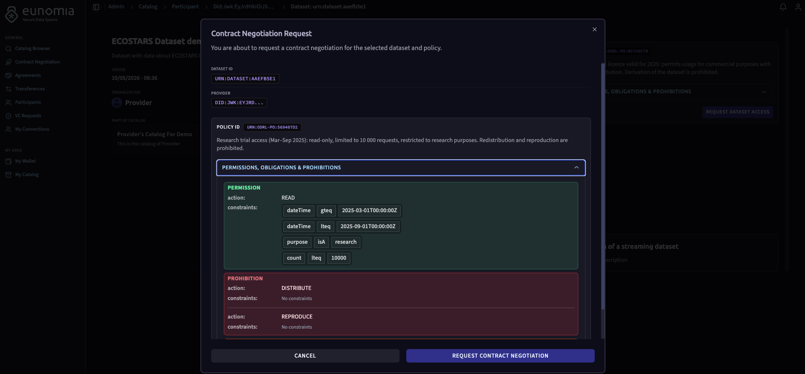
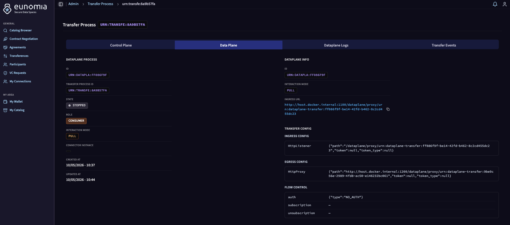
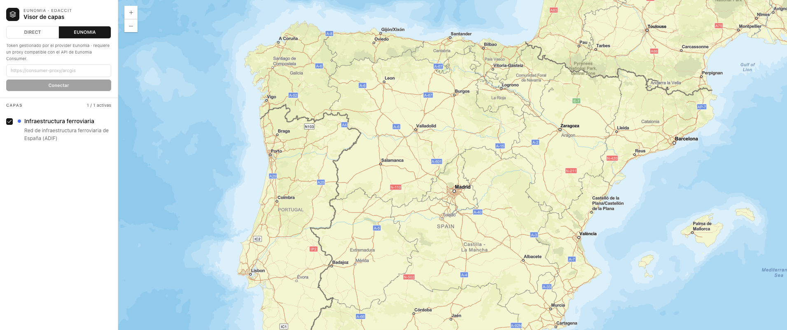

# EDACCIT Deployment

[](https://opensource.org/licenses/Apache-2.0)
[](https://www.docker.com/)
[](https://developers.arcgis.com/)
[](https://fastapi.tiangolo.com/)
[](https://react.dev/)
[](https://gaia-x.eu/)
[](https://docs.internationaldataspaces.org/ids-knowledgebase/v/dataspace-protocol)

This repository contains the artifacts and scripts to deploy and demonstrate the **EDACCIT** pilot on top of the **Eunomia** dataspace framework. The pilot models a geospatial data exchange: a **Provider** publishes transport and meteorological datasets hosted on an ArcGIS Enterprise server, and a **Consumer** negotiates governed access to them — both as participants of an Eunomia dataspace. A **Map Viewer** renders the datasets and can switch at runtime between direct access and dataspace-mediated proxy access.

---

## Architecture

```text
                          ┌─────────────┐
                          │  Heimdall   │  (Authority / Clearing House)
                          └──────┬──────┘
                                 │
            ┌────────────────────┴────────────────────┐
            │                                         │
    ┌───────▼────────┐                       ┌────────▼────────┐
    │ Provider Agent │  ◄── DSP transfer ──► │ Consumer Agent  │
    └───────┬────────┘                       └────────┬────────┘
            │                                         │
    ┌───────▼────────┐                       ┌────────▼────────┐
    │ ESRILab ArcGIS │                       │   Map Viewer    │
    │    Server      │                       │ React + FastAPI │
    └────────────────┘                       └────────────────┘
```

### Dataspace layer (Eunomia)

- [**Eunomia DS-Agent**](https://github.com/EunomiaUPM/ds-agent): Dataspace Agents handling DSP protocol logic for each participant.
- [**Heimdall**](https://github.com/EunomiaUPM/heimdall): Dataspace Authority and Clearing House governing onboarding and compliance.

### EDACCIT layer

- **Provider**: The ESRILab ArcGIS Enterprise server (`edaccit.esrilab.es`). Its datasets are described as DCAT-AP 3.0.1 metadata and published to the Provider Agent's catalog by the metadata ingestion pipeline.
- **Map Viewer**: A React application using the ArcGIS Maps SDK. It supports two access modes selectable at runtime from the sidebar:
  - **DIRECT** — the FastAPI backend fetches a token from ESRILab and proxies it to the SDK. Used for development.
  - **EUNOMIA-CONSUMER** — the user pastes the dataplane proxy URL obtained after a DSP negotiation. The SDK routes all requests through the Consumer's transfer endpoint; the token is injected server-side by the Provider Agent. No credentials are exposed to the browser.

---

## Catalog

The Provider publishes the following datasets:

| Dataset                                                | Source         | Type          |
| ------------------------------------------------------ | -------------- | ------------- |
| Infraestructura ferroviaria (ADIF)                     | ESRILab ArcGIS | FeatureServer |
| Estaciones ferroviarias (IGN)                          | ESRILab ArcGIS | FeatureServer |
| AEMET valores climatológicos diarios por estación      | AEMET API      | REST/JSON     |
| AEMET predicción meteorológica municipal diaria        | AEMET API      | REST/JSON     |
| Copernicus ERA5 viento horario global (subconjunto v1) | CDS API        | REST/JSON     |
| Slots aeroportuarios (AECFA NAP)                       | NAP            | REST/JSON     |
| Aeropuertos España — tráfico civil 2016                | Open data      | REST/JSON     |
| FC lastcycle daily — Palma, Ibiza, Mahón, Castellón    | FC API         | REST/JSON     |

Metadata is authored as DCAT-AP 3.0.1 JSON-LD files in [`services/metadata-ingestion/metadata/`](services/metadata-ingestion/metadata/) and converted to provider API payloads by `scripts/ingest.sh`.

---

## Requirements

- Docker and Docker Compose (or Docker Desktop)
- `curl`, `jq` and `bash` installed
- Permissions to execute scripts (`chmod +x`)
- The following local ports must be free:

| Port   | Service              |
| ------ | -------------------- |
| `1500` | Heimdall (Authority) |
| `1200` | Provider DS-Agent    |
| `1100` | Consumer DS-Agent    |
| `8000` | Map Viewer           |
| `1450` | Heimdall PostgreSQL  |
| `1400` | Provider PostgreSQL  |
| `1300` | Consumer PostgreSQL  |
| `6379` | Provider Redis       |
| `6380` | Consumer Redis       |

---

## Quick start

```bash
git clone https://github.com/EunomiaUPM/eunomia-edaccit-deployment.git
cd eunomia-edaccit-deployment
cp .env.example .env          # fill in your ArcGIS credentials
./scripts/deploy-mini.sh
```

> [!NOTE]
> `.env` holds ArcGIS credentials and is git-ignored, so it is never shipped with the repo:
> every machine needs its own copy from `.env.example`.

That's it. Roughly three minutes later you have the authority, both agents, their wallets,
the ingested catalog and the map viewer running, with onboarding done.

### What just happened

`deploy-mini.sh` runs the whole sequence so you don't have to:

1. **ArcGIS token** — mints one via `scripts/arcgis-token.sh` and exports it as `API_VALUE`.
   The token is baked into every connector instance, so ingestion needs it up front.
2. **Authority** — Heimdall plus its Fafnir wallet and Postgres.
3. **Provider** — agent, wallet, Postgres, Redis, and the one-shot `metadata-ingestion`
   job that populates the catalog.
4. **Consumer** — same shape, minus the ingestion.
5. **Map viewer** — built and served on port 8000.
6. **Onboarding** — links the three wallets, gets both participants a
   `DataSpaceParticipant` credential from the authority, and completes the
   consumer↔provider GNAP handshake.

Every step is idempotent, so this is also the **update path**:

```bash
git pull
./scripts/deploy-mini.sh
```

The catalog is not duplicated, and participants that already hold their credential are
left alone.

Flags: `--no-map-viewer`, `--no-onboarding`. Set `API_VALUE` beforehand to reuse a token
you already have.

> [!IMPORTANT]
> Docker publishes these ports on IPv6 as well as IPv4. If a natively built `monolith` or
> `heimdall` is still listening on 1100/1200/1500, `127.0.0.1:<port>` reaches that process
> instead of the container, while the container still looks perfectly healthy.
> `deploy-mini.sh` refuses to start when it detects one.

---

## Scripts

| Script | What it does |
| ------ | ------------ |
| [`deploy-mini.sh`](scripts/deploy-mini.sh) | **Start here.** Token → all four stacks → onboarding. Idempotent; also the update path. `--no-map-viewer`, `--no-onboarding`. |
| [`mini-onboarding.sh`](scripts/mini-onboarding.sh) | Onboarding only: links wallets, then runs the two scripts below. Safe to re-run. |
| [`register-with-authority.sh`](scripts/register-with-authority.sh) | Gets one participant a `DataSpaceParticipant` credential from Heimdall. Needs `PARTICIPANT_URL`; `PARTICIPANT_NICK` labels the logs. Skips if already held. |
| [`authenticate-participants.sh`](scripts/authenticate-participants.sh) | Runs the GNAP handshake that mints the consumer's mate token for the provider. Skips if already authenticated. |
| [`arcgis-token.sh`](scripts/arcgis-token.sh) | Prints an ArcGIS token to stdout, nothing else — built for `export API_VALUE=$(./scripts/arcgis-token.sh)`. |
| [`ingest.sh`](scripts/ingest.sh) | Regenerates the payloads from the JSON-LD metadata and POSTs them to the provider. Skips datasets already registered; `--force` re-POSTs, `--dry-run` prints. |
| [`ingest-arcgis-token.sh`](scripts/ingest-arcgis-token.sh) | `arcgis-token.sh` + `ingest.sh` in one call, asking for a long-lived token. Use it to re-ingest from the host. |
| [`smoke-test.sh`](scripts/smoke-test.sh) | Checks ESRILab connectivity and the token flow, independently of the dataspace. |
| [`gaia.sh`](scripts/gaia.sh) | GAIA-X credential flow helpers. |
| [`lib.sh`](scripts/lib.sh) | Shared helpers: default URLs, logging, `curl_raw`/`curl_checked`, `load_arcgis_env`. Sourced by the rest. |

All scripts read their default URLs from `lib.sh` and accept overrides from the environment:

```bash
AUTHORITY_URL=http://127.0.0.1:1500 \
CONSUMER_URL=http://127.0.0.1:1100 \
PROVIDER_URL=http://127.0.0.1:1200 \
./scripts/mini-onboarding.sh
```

---

## Deploying by hand

The stacks live in [`deployment/mini/`](deployment/mini/), one Compose file per role:

```bash
export API_VALUE=$(./scripts/arcgis-token.sh)
docker compose -f deployment/mini/docker-compose.mini.heimdall.yaml   up -d --wait
docker compose -f deployment/mini/docker-compose.mini.provider.yaml   up -d
docker compose -f deployment/mini/docker-compose.mini.consumer.yaml   up -d
docker compose -f deployment/mini/docker-compose.mini.map-viewer.yaml up -d --build
./scripts/mini-onboarding.sh
```

Notes on the ordering:

- **`API_VALUE` is required** by the provider file, which carries the one-shot
  `metadata-ingestion` service. It waits for the provider on its own (up to 4 minutes), so
  no extra sequencing is needed. To start the connector without ingesting, use
  `up -d provider`; to ingest from the host instead, use `scripts/ingest.sh`.
- **The map viewer needs `--build`**: Vite bakes `VITE_ARCGIS_BASE_URL` into the bundle at
  build time, so a plain `up` keeps serving the old one after a pull. Docker's layer cache
  makes it a no-op when the frontend hasn't changed.
- **Wait for the agents before onboarding.** They expose no healthcheck, so Compose reports
  them up the moment the process starts — a few seconds before the router is listening.
  `deploy-mini.sh` polls for this.

### Wallets

Each role runs its own [**Fafnir**](https://github.com/EunomiaUPM/fafnir-wallet) wallet
inside its own Compose file — there is no external wallet to start beforehand. Every stack
brings up a `*-fafnir-setup` one-shot job that runs the wallet migrations against the role's
Postgres, then a `*-fafnir-wallet` service listening on `7001` inside the Compose network
(not published to the host) behind a `/readiness` healthcheck. The agent and Heimdall only
start once their wallet reports healthy. The address is configured in
`static/config/<role>/mini/*.yaml` under `wallet_config`.

Database and wallet credentials live in `vault/<role>/secrets/*.example` and are mounted
read-only into the containers.

### Map viewer in development

Hot-reload, no Docker:

```bash
# Terminal 1 — FastAPI backend (reads the repo-root .env)
cd services/map-viewer
uvicorn main:app --reload --port 8000

# Terminal 2 — Vite dev server
cd services/map-viewer/frontend
cp .env.example .env.development.local   # set VITE_AUTH_MODE and VITE_ARCGIS_BASE_URL
npm install
npm run dev
```

---

## Usage

### Contract negotiation and data transfer

Use the Eunomia DS-Agent UI to start a DSP-compliant contract negotiation and then initiate a transfer session:

| Agent    | URL                     |
| -------- | ----------------------- |
| Provider | `http://127.0.0.1:1200` |
| Consumer | `http://127.0.0.1:1100` |



After negotiation, trigger a transfer. The Consumer Agent creates a dataplane proxy endpoint for the agreed dataset:



### Connecting the Map Viewer to the dataspace

Once a transfer is active, copy the **dataplane proxy URL** from the Consumer UI. It looks like:

```text
http://localhost:1100/dataplane/proxy/urn:dataplane-transfer:<uuid>
```

Open the Map Viewer at `http://localhost:8000`, switch the sidebar toggle to **EUNOMIA**, paste the URL, and click **Conectar**. The SDK will route all layer requests through the Consumer's transfer endpoint — the ArcGIS token is injected by the Provider Agent and never reaches the browser.

### Automated end-to-end test

`e2e/` drives the whole flow above over the API instead of the UI: catalog request, the eight-step DSP contract negotiation, the transfer process, a real data fetch through the dataplane proxy, and suspend/resume/complete. It asserts the state reached at every step and exits non-zero on the first failure.

It runs inside a container, so **Docker is the only requirement** — no Python or shell needed on the machine, which is what makes it usable on the Windows production host.

Two entry points, differing only in what happens to the transfer at the end — `run-complete` finishes the lifecycle, `run-keep-open` stops at `STARTED` and prints the dataplane proxy URL for the Map Viewer:

```bat
REM Windows (cmd or PowerShell)
e2e\run-complete.bat
e2e\run-keep-open.bat
```

```bash
# macOS / Linux
./e2e/run-complete.sh
./e2e/run-keep-open.sh
```

Each is a one-line call to `docker compose -f e2e/docker-compose.e2e.yaml run --rm --build e2e`, which you can use directly if you prefer.

It assumes `deploy-mini.sh` already ran (agents up, participants onboarded, catalog populated) and checks that before starting. It negotiates the **Red de ferrocarriles de España – Estaciones** dataset — the one whose connector points at the ESRILab ArcGIS server, so the fetch also proves the Provider injected the token (an anonymous caller gets the same `200` with an empty service list).

Arguments are forwarded to the test:

```bat
e2e\run-complete.bat --list-datasets    REM what the catalog offers
e2e\run-complete.bat -v                 REM dump every DSP request and response
```

See [`e2e/README.md`](e2e/README.md) for the full option list, how to point it at a remote deployment, and how to run the script without Docker.

### Verifying ArcGIS connectivity

Use the smoke test script to check that the ESRILab server is reachable and the token flow works independently of the dataspace:

```bash
bash scripts/smoke-test.sh
```

Credentials are read from the repo-root `.env`. Any variable already exported in the shell takes precedence.

---

## Map Viewer modes

| Mode        | How auth works                                                                                                                                        | When to use                                        |
| ----------- | ----------------------------------------------------------------------------------------------------------------------------------------------------- | -------------------------------------------------- |
| **DIRECT**  | FastAPI backend fetches an ESRILab token and proxies it into every SDK request via `/arcgis-proxy`.                                                   | Local development, direct connectivity to ESRILab. |
| **EUNOMIA** | User pastes the Consumer transfer URL at runtime. FastAPI forwards SDK requests to the Consumer via `/eunomia-proxy`; the Provider injects the token. | Demo of DSP-governed access.                       |

Switching modes in the sidebar remounts the ArcGIS MapView cleanly, preventing stale SDK cache from a previous session.



---

## Configuration

### Map Viewer environment

Backend (repo-root `.env`, from `.env.example`):

| Variable                  | Description                                                                                                         |
| ------------------------- | ------------------------------------------------------------------------------------------------------------------- |
| `ARCGIS_PORTAL_URL`       | ESRILab portal root (e.g. `https://edaccit.esrilab.es/portal`)                                                      |
| `ARCGIS_SERVER_URL`       | ESRILab server root (e.g. `https://edaccit.esrilab.es/server`)                                                      |
| `ARCGIS_USERNAME`         | Service account username                                                                                            |
| `ARCGIS_PASSWORD`         | Service account password                                                                                            |
| `ARCGIS_TOKEN_EXPIRY`     | Token lifetime in minutes (default: `120`)                                                                          |
| `ARCGIS_REFERER`          | Referer used when generating the token (must match frontend origin)                                                 |
| `ARCGIS_VERIFY_SSL`       | Set to `false` to skip TLS verification                                                                             |
| `EUNOMIA_LOCALHOST_ALIAS` | Set to `host.docker.internal` when running in Docker so that `localhost` in proxy URLs resolves to the host machine |

Frontend (`services/map-viewer/frontend/.env.development.local`):

| Variable               | Description                                                                                |
| ---------------------- | ------------------------------------------------------------------------------------------ |
| `VITE_AUTH_MODE`       | `direct` or `eunomia-consumer` — baked into the bundle at build time                       |
| `VITE_ARCGIS_BASE_URL` | ArcGIS server root used to construct layer URLs (e.g. `https://edaccit.esrilab.es/server`) |

### DID method

- **Mini / local**: uses `did:jwk`. Public DNS is not required for local testing.
- **Production**: uses `did:web` for GAIA-X compliance.

---

## GAIA-X Compliance

To enable GAIA-X compliance, apply the following three changes to **both** the Provider Agent and the Consumer Agent configs.

### 1 — Verification configuration

```yaml
verify_req_config:
  is_cert_allowed: false
  vcs_requested: [gx:LabelCredential]
```

### 2 — GAIA-X connectivity

```yaml
gaia_config:
  api:
    protocol: "http" # mini: http | prod: https
    url: "host.docker.internal" # mini | prod: your.domain.com
    port: "1500" # mini: Heimdall port | prod: null
```

### 3 — Heimdall startup command

In the Heimdall Compose file, change the command for both `heimdall` and `heimdall-setup`:

```yaml
command:
  - setup # or start
  - --env-file
  - /app/static/config/eco_authority.yaml
```

> [!NOTE]
> `eco_authority.yaml` activates all Heimdall roles simultaneously (GAIA-X Clearing House, Legal Authority, Dataspace Authority). In a real ecosystem these roles should be held by separate entities — this multi-role configuration is for development and testing only.
